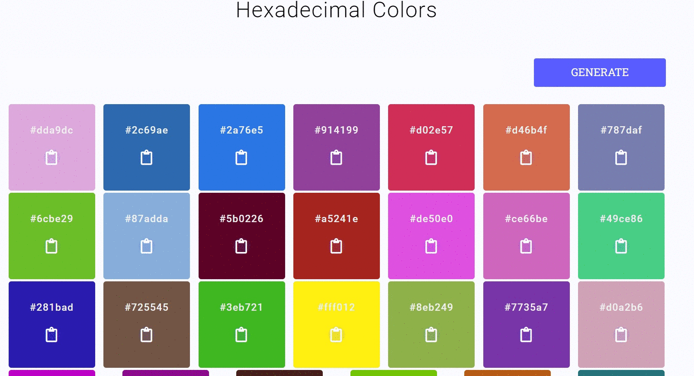

# Задание
- Компонент LoginPass отрефакторить, используя технологию ref.
  - Реализовать проверку на заполненность полей. При нажатии на кнопку входа, если поля пустые, подсвечивать незаполненное поле, установить фокус на ввод, показывать соответствующую подсказку.
- Разработайте следующее приложение(cм. GIF). По умолчанию приложение генерирует 27 шестнадцатеричных цветов. Если нажать кнопку Generate, сгенерируются еще 27 шестнадцатеричных цветов. В своём решении используйте подход, рассмотренный на уроке.
  
